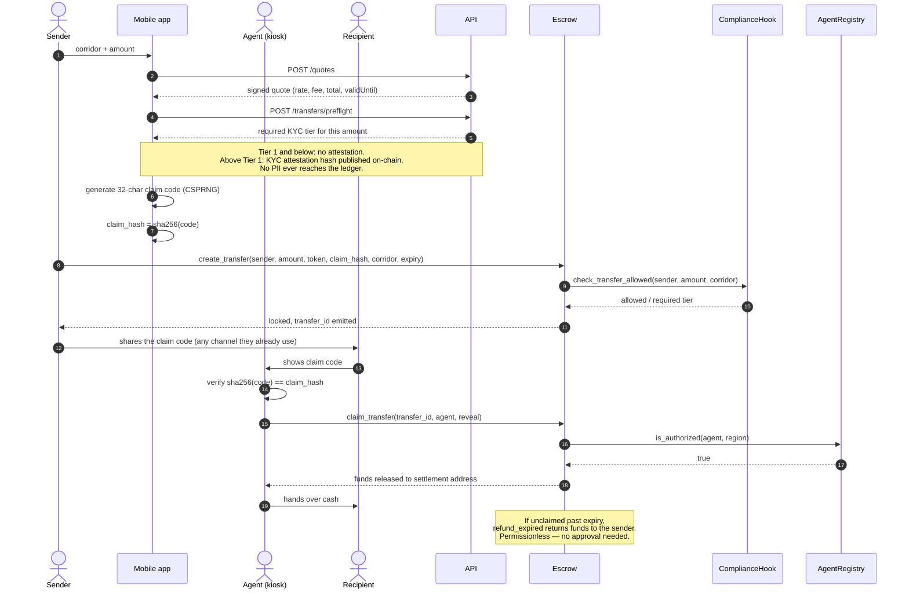
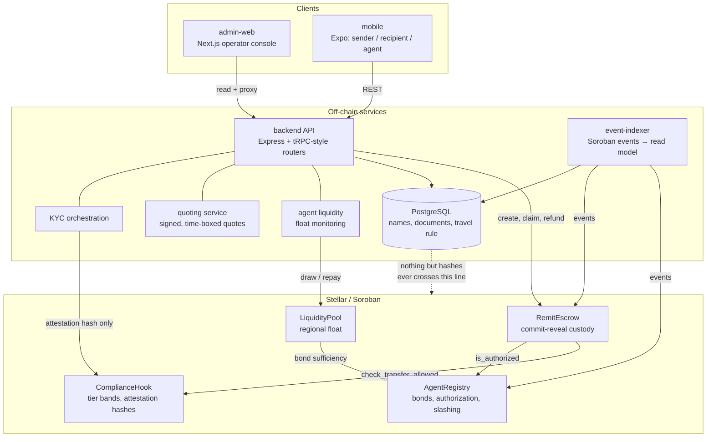
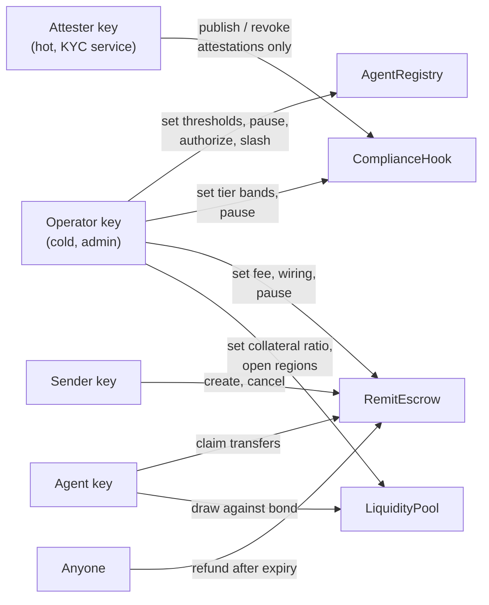

# RemitBridge

An open, compliant **last-mile cash-out network** for Stellar remittances.

Stellar moves value across borders in seconds for fractions of a cent. Turning
that value into cash in a recipient's hand is still the broken part: in most
underserved corridors the last mile is a correspondent bank, a mobile-money
float, or nothing at all. RemitBridge gives smaller anchors and MTOs an open,
composable **agent-network layer** — local shop owners and kiosks acting as
cash-out points — with KYC tiering and on-chain escrow, so they do not have to
build custody infrastructure from scratch to serve a corridor.

The recipient needs no wallet, no bank account and no seed phrase. They show a
claim code to a local agent and walk away with cash.

---

## Table of contents

- [How a transfer works](#how-a-transfer-works)
- [Architecture](#architecture)
- [Trust and compliance model](#trust-and-compliance-model)
- [Repository layout](#repository-layout)
- [Tech stack](#tech-stack)
- [Quick start](#quick-start)
- [Testing](#testing)
- [Deployment](#deployment)
- [Verification status](#verification-status)
- [Security considerations](#security-considerations)
- [Roadmap](#roadmap)
- [Contributing](#contributing)
- [License](#license)

---

## How a transfer works



**The commit-reveal core.** The escrow stores `sha256(claim_hash)` and never the
claim code, and its `reveal` parameter is `BytesN<32>`. The mobile app therefore
generates a **32-character code from a 32-symbol alphabet**, so its UTF-8 bytes
are exactly 32 bytes and *are* the reveal. Nothing sits between what a customer
writes down and what the contract verifies. The alphabet is Crockford base32 —
no `I`, `L`, `O` or `U` — because codes get read aloud across a counter.

---

## Architecture



Full component detail, event flows and data model: [docs/architecture.md](docs/architecture.md).

---

## Trust and compliance model

This is the section to read critically, because everything else depends on it.

### What is on-chain, and what is not

| On-chain | Off-chain |
| --- | --- |
| Transfer amounts, token address, expiry, status | Sender and recipient **names** |
| `sha256(claim_code)` — the commit hash | The claim code itself (sender's and agent's devices) |
| `sha256` of each KYC attestation payload | Passport / ID **numbers** |
| Agent bond balances, status, region, slash history | Screenshots, documents, selfies |
| Region and corridor **identifiers** (`Symbol`s) | Travel-rule payloads |
| Fee and tier **thresholds** | Human-readable region and corridor names |
| Aggregate volume counters | Screening results and provider references |

**No PII is ever written to the ledger, and this is a design constraint rather
than a policy.** A ledger is append-only and world-readable; a home address
written to one is a permanent, irreversible disclosure with no deletion path.
The compliance hook therefore accepts an *attestation hash* — `sha256` of the
provider's canonical payload — and the payload that produced it never leaves the
backend database, where retention rules and access control can actually be
enforced. This is stated in the contract rustdocs as well, next to the function
that consumes the hash.

### Who can do what



The **attester key is deliberately not the admin key.** The KYC service runs hot
and is the most exposed component in the system, so a compromise of it must not
grant the ability to reconfigure compliance thresholds, unpause the network,
authorize agents or move funds. It can publish and revoke attestations and
nothing else.

`refund_expired` is **permissionless**. Anyone may trigger it after expiry, and
it can only return funds to the original sender. This is intentional: a refund
that required operator action would be a refund an operator could withhold.

### Why bonding and slashing

A payer hands value to the network *before* a claim is redeemed, and an agent
hands over cash *before* the on-chain claim settles. The bond is what makes both
sides safe from the other's counterparty risk:

- The bond is real capital an agent can lose, so walking away with a claim has a
  cost. `slash_agent` reduces it, admin-gated, for confirmed fraud or no-show.
- The bond also caps how much float an agent can draw. `LiquidityPool` reads the
  bond from `AgentRegistry` and computes required collateral at the contract's
  own ratio (150%), so the figure the agent plans against is the figure the chain
  enforces.
- Slashing redirects to the treasury, not to the operator's own account, and
  emits an event. Both are visible on-chain.

### What this system does not claim

- **It is not a licensed money transmitter.** RemitBridge is infrastructure an
  anchor or MTO operates under *their* licences. Corridor-level regulatory
  review is the operator's responsibility, and no amount of code changes that.
- **The carrier it ships with is a mock — the real one is a config change.** Two
  implementations of `IdVerificationProvider` are in the tree: `mock`, which is
  deterministic and holds no external state, and used by CI; and `http`, an HTTP
  adapter over a vendor's REST API with signature-verified webhooks. Selecting
  the real one is `KYC_PROVIDER=http` plus a base URL — no call site moves.
  Sumsub and Onfido are *not* shipped as named adapters; pointing `http` at their
  API is how they are used. What is not claimed is any vendor-specific behaviour
  beyond the documented request/response contract.
- **The operator console's accounts are configuration, not identity.** It now
  requires a credential — signed session cookie, per-action role checks, and the
  operator's own address written into the audit trail — but there is no user
  table and no SSO. Operators live in `OPERATOR_ACCOUNTS`, so onboarding one is a
  deploy and the session carries the roles it was issued with until it expires.
  SSO is roadmap item 1, and the console remains `noindex` either way.
- **The price source is real but the corridor mapping is not.** `PRICE_SOURCE`
  selects between a live Stellar DEX read through Horizon and a static
  placeholder. The DEX source refuses — by name — when a currency has no asset
  configured, rather than inventing a rate. The static source still labels every
  quote `oracleSource: "static-config"`, because a rate with no provenance is
  indistinguishable from a stale one.

---

## Repository layout

```
remitbridge/
├── contracts/                 # Soroban / Rust workspace
│   ├── interfaces/            # shared trait + type definitions (rlib only)
│   ├── agent-registry/        # bonds, authorization, slashing
│   ├── compliance-hook/       # tier bands, attestation hashes
│   ├── remit-escrow/          # commit-reveal custody
│   └── liquidity-pool/        # regional float against bonded collateral
├── backend/                   # Node + TypeScript + Prisma
│   ├── src/kyc-orchestration/ # provider interface, mock + HTTP adapter, tiers
│   ├── src/agent-liquidity/   # float monitoring, top-up approvals
│   ├── src/quoting-service/   # signed quotes, static + Horizon DEX price sources
│   ├── src/event-indexer/     # contract events → Postgres read model
│   ├── src/api/               # Express server, middleware, OpenAPI
│   └── prisma/                # schema + seed
├── admin-web/                 # Next.js operator console
│   ├── src/lib/auth/          # operator accounts, signed sessions, role policy
│   ├── src/proxy.ts           # the gate: session check + per-action authorisation
│   ├── scripts/operator-hash.mjs  # produces the scrypt hashes OPERATOR_ACCOUNTS holds
│   ├── src/                   # pages, server-side API client, response schemas
│   └── e2e/                   # Playwright suite + the stub backend it drives
├── mobile/                    # Expo app: sender / recipient / agent
├── scripts/                   # build, deploy, wire the four contracts
├── docs/                      # architecture, trust model, runbook
├── .github/workflows/         # CI: contracts, backend, frontends, tooling
└── docker-compose.yml
```

**Why `contracts/interfaces` exists as its own crate.** The contract crates
initially depended on each other for their types, which made the escrow's Wasm
build export the registry's entire ABI. Soroban Wasm entry points collide, so
that artifact cannot be deployed — and the failure only appears at deploy time.
Extracting the shared traits into an `rlib`-only crate removes the dependency
between the `cdylib`s entirely. CI now asserts the property directly by reading
each artifact's export table; see `.github/workflows/contracts.yml`.

---

## Tech stack

| Layer | Choice | Why this one |
| --- | --- | --- |
| Contracts | Rust, Soroban SDK, `no_std` | The only way to run logic on Stellar that holds funds |
| Contract errors | `#[contracterror]` enums, `Result` | A typed error is a code the backend maps to a specific HTTP response; a panic is a mystery |
| Backend | Node 22, TypeScript (strict + `exactOptionalPropertyTypes`) | Shares a language with both frontends; strict enough to make money bugs type errors |
| API | Express 4 + Zod | Express 4's async error behaviour is handled explicitly rather than assumed |
| Database | PostgreSQL + Prisma | `Decimal(39,0)` holds a full `i128`; a `BIGINT` would truncate a large transfer |
| Money | `bigint` end to end, strings on the wire | A JSON number is parsed as a double before any validation runs |
| Console | Next.js 16, React 19, Tailwind v4 | Server components read the API; browsers never talk to it directly |
| Mobile | Expo SDK 57, expo-router | One codebase, real device builds without a local native toolchain |
| KYC | Pluggable `IdVerificationProvider`, mock + HTTP adapter | The commercial dependency will change; the interface should not. Both adapters are real implementations of it, so switching is config, not a refactor |
| Price feed | Stellar DEX via Horizon `paths/strict-send` | The executable rate for a probe size, following whatever path the market uses — an `/order_book` call only prices a pair that trades against itself, which almost nothing on the DEX does |
| Console auth | scrypt hashes in configuration, HMAC-signed session cookie, Edge `proxy.ts` | WebCrypto only, so one signature check runs in both the Edge gate and the Node route handler; no user table means no operator credentials sitting beside the KYC data |
| Console tests | vitest for modules, Playwright for the browser | vitest reaches the schemas, the session format and the role table; only a browser reaches the gate, the proxy path, and what a page refuses to render |
| CI | GitHub Actions | Separate workflows per component so a failure names its own cause |

### Two version choices worth explaining

**Next.js 16, not 14.** Every Next release below 16.3.5 carries published
advisories. A console that can authorize an agent and approve a float move should
not ship a known-vulnerable framework, and `npm audit` is clean here as a result.
Tailwind v4 follows from that, since Turbopack (Next 16's default builder) cannot
resolve Tailwind v3's internal asset paths.

**Strict TypeScript everywhere, including `exactOptionalPropertyTypes`.** In a
service that decides whether a transfer is allowed, an absent field and a field
that is present-and-`undefined` are different states, and conflating them is how
a compliance check silently passes.

---

## Quick start

Prerequisites: **Node 22+**, **Rust stable + `wasm32v1-none`**, Docker
(for Postgres), and optionally the `stellar` CLI.

### 1. Contracts

```bash
cd contracts
cargo test --all-features          # 115 tests
cargo clippy --all-targets -- -D warnings
cargo fmt --all --check
```

Build deployable Wasm:

```bash
cd ../scripts
npm install
npm run build:contracts            # writes contracts/target/wasm32-unknown-unknown/release
```

### 2. Deploy and wire (Stellar Testnet)

```bash
cd scripts
cp .env.example .env               # fills admin / treasury / attester / token
cp config/testnet.example.json config/testnet.json

npm run deploy:dry-run             # validates args + encoding, submits nothing
npm run deploy                     # uploads, deploys, initializes, wires, verifies
```

`deploy` writes `deployed-addresses.json` (gitignored) and refuses to clobber an
existing one. The ordering matters and is explained at the top of
`scripts/src/deploy-contracts.ts`: all four instances deploy *before* any is
initialized, so a failure leaves unused instances rather than live contracts
pointing at zero addresses.

### 3. Database and backend

```bash
docker compose up -d postgres
cd backend
cp .env.example .env               # paste the four contract ids from step 2
npm install
npm run prisma:generate
npm run prisma:migrate -- --name init   # generates prisma/migrations/
npm run prisma:seed                     # regions + corridors from the same config
npm run dev                             # http://localhost:4000
npm run indexer                         # separate process: events → read model
```

Whole stack in containers instead:

```bash
cp backend/.env.example .env       # compose reads the repo-root .env
docker compose up --build
```

`/readyz` reports which contracts the backend is *actually* wired to, which is
the first thing to check when something looks wrong.

### 4. Operator console

The console now requires a credential, so two variables must be set before it will
serve anything — with `OPERATOR_SESSION_SECRET` unset it refuses every request
rather than serving an unauthenticated console that looks configured.

```bash
cd admin-web
cp .env.example .env.local         # REMITBRIDGE_API_URL + the two auth variables
npm install

export OPERATOR_SESSION_SECRET="$(openssl rand -base64 48)"
export OPERATOR_ACCOUNTS="[{\"email\":\"you@example.com\",\"name\":\"Your Name\",\"passwordHash\":\"$(node scripts/operator-hash.mjs 'your password')\",\"roles\":[\"admin\"]}]"

npm run dev                        # http://localhost:3000/login
```

Accounts are configuration rather than rows in a table, for the reason given
under [Security considerations](#security-considerations): an operator credential
should not live in the same database as the KYC data. The three roles are `viewer`
(reads only), `operator` (moves float) and `admin` (adds KYC revocation).
`scripts/operator-hash.mjs` produces the hashes — plaintext is rejected at boot
rather than hashed on the fly.

### 5. Mobile

```bash
cd mobile
cp .env.example .env
npm install
npm start                          # then i / a, or scan with Expo Go
```

On a physical device, `localhost` is the phone — set `EXPO_PUBLIC_API_URL` to
your machine's LAN address.

---

## Testing

```bash
# Contracts — 115 tests, clippy clean
cd contracts && cargo test --all-features

# Backend — 93 tests
cd backend && npm test

# Frontends — 71 tests (console), 33 tests (mobile)
cd admin-web && npm test
cd mobile    && npm test

# Console end to end — 56 tests in a real browser, against a production build
# Needs the browser once: npx playwright install --with-deps chromium
cd admin-web && npm run test:e2e

# Typechecks and lint for every component
cd backend   && npm run typecheck && npm run lint
cd admin-web && npm run typecheck && npm run lint
cd mobile    && npm run typecheck && npm run lint
cd scripts   && npm run typecheck
```

What the suites cover, and why those cases:

- **Contracts** — commit-reveal edge cases (wrong reveal, replay, double claim),
  expired-transfer refund races, unauthorized-agent claims, bond-insufficient
  draws, tier-band boundaries, admin-gating on every privileged call.
- **Backend** — exact money arithmetic far beyond `2^53`, event decoding that
  *fails* rather than defaulting, every KYC provider branch including rejections,
  float alert classification, quote signature round-trips, and request-body
  parsing per route. The provider suites exist because a mock that always
  approves never exercises the paths that matter in a compliance product, and
  because a *real* adapter's failure modes are the ones that reach production:
  the HTTP provider is tested against a stub vendor that returns a non-2xx, a
  body outside the contract, an unknown outcome, and a webhook signed with the
  wrong key — every one of which must refuse rather than approve. The Horizon
  source is tested the same way, including a path that does not exist and an
  amount Horizon returns that is not a decimal.
- **Frontends** — the pure modules, under vitest. The console's 71 tests cover
  its response boundary — an amount arriving as a JSON number, an undeclared
  field, an unrecognised status, a pool snapshot missing its staleness flag —
  where each must fail validation and render as unavailable rather than as an
  empty table. They also cover the session format (signature, expiry, a token
  issued in the future, a tampered payload) and the role table, because a gate
  whose tests only assert the happy path is a gate nobody has checked. The mobile
  app's 33 tests cover the claim-code protocol in full: byte length, alphabet,
  normalisation, the repair rules for `I`/`L`/`O`, and a malformed entry reported
  separately from a mismatch. `expo-crypto` is aliased to a real `node:crypto`
  double, so the hashing assertions mean something. The console's rendering and
  end-to-end behaviour is covered separately, next.
- **Console end to end** — 56 tests driving a real browser against a production
  `next build`, with a stub backend answering in place of the API
  (`admin-web/e2e/`). It exists for what nothing else can reach: the browser →
  `/api/backend/*` proxy → backend path that every operator action takes, the
  confirmation in front of an irreversible one, and the three states a list must
  never confuse — empty, unavailable, and shape-wrong. The stub is a model of the
  backend rather than the backend, and what that leaves unproven is in the
  verification table below. The auth specs are the clearest case for the suite
  existing at all: "a viewer cannot approve a top-up" is not a claim about a
  hidden button, and only a real request can show the server refusing one.

---

## Deployment

| Component | Target | Command |
| --- | --- | --- |
| Contracts | Stellar Testnet | `cd scripts && npm run deploy` |
| Backend + indexer | Railway / Render / Fly.io | `docker compose` or the `backend/Dockerfile` |
| Console | Vercel | `cd admin-web && vercel --prod` |
| Mobile | EAS Build | `cd mobile && npx eas build --profile preview --platform android` |

The console needs `OPERATOR_SESSION_SECRET` and `OPERATOR_ACCOUNTS` set on the
host as well as locally — it refuses every request without them, so a deployment
that forgets them is a console that answers `500` rather than one that lets
anyone in. `OPERATOR_SESSION_SECRET` is a secret; `OPERATOR_ACCOUNTS` holds
hashes, not passwords, and two instances that disagree about it will disagree
about who can sign in.

Testnet contract addresses and hosted URLs are written to
`deployed-addresses.json` by the deploy script and belong here once a deployment
has been run:

```
AgentRegistry    C…
ComplianceHook   C…
LiquidityPool    C…
RemitEscrow      C…
```

They are left blank rather than filled with placeholder values, because a
plausible-looking address is worse than an obvious gap.

---

## Verification status

Recorded honestly, because the distinction between "written" and "verified" is
the difference between code someone can rely on and code they cannot.

**Verified locally**

| Component | Evidence |
| --- | --- |
| Contracts | 115 tests pass; `clippy --all-targets -- -D warnings` clean; `cargo fmt --check` clean; all four Wasm artifacts build and export only their own ABI |
| Backend | 93 tests pass; `tsc --noEmit` clean; ESLint (type-aware) clean; production build succeeds |
| Backend: HTTP KYC provider | Tested against a stub vendor over the real `fetch` path: contract-valid approval, a non-2xx, a body outside the contract, an unknown outcome, a timeout, and a webhook with a wrong, absent or unconfigured signature — each refusing rather than approving |
| Backend: Horizon price source | Tested against recorded Horizon responses, including one captured from `horizon.stellar.org` for a real USDC path; a currency with no configured asset, an empty path list, a non-decimal amount and a non-2xx all raise a named 503 rather than producing a rate |
| Backend container | Image builds; entrypoint applies the schema to a live Postgres; API starts and serves `/healthz`, `/readyz`, `/openapi.json` and DB-backed routes; a signed quote was produced end to end through the container |
| Deploy tooling | `tsc --noEmit` clean; full `--dry-run` walks upload → deploy → initialize → wire → verify for all four contracts, exercising real argument encoding |
| Console | 71 unit tests pass; `tsc --noEmit` clean; ESLint clean; `next build` succeeds with all routes dynamic (including the Edge bundle, which is what catches a `node:crypto` import reaching the gate); `npm audit` reports 0 vulnerabilities |
| Console (end to end) | 56 Playwright tests pass in headless Chromium against the `next build` output served on a real port: every page, the mutation path through `/api/backend/*`, the confirmation guard on revocation, the empty / unavailable / malformed distinctions, and the gate — a visitor redirected to `/login` with their destination remembered, a wrong password refused identically to an unknown email, a `next` pointing off-site ignored, sign-out ending the session for the *next* request, a viewer refused with 403 by the server on a top-up decision, and a route with no policy refused rather than forwarded |
| Mobile | 33 tests pass; `tsc --noEmit` clean; ESLint clean |

**Not yet verified**

- **No on-chain deployment has been run.** The deploy script is exercised only in
  dry-run mode, so contract *state* checks (as opposed to argument encoding) are
  unproven against a live network. This is the single largest gap.
- **No mobile native build.** Typecheck and lint pass; an EAS build has not been
  produced in this environment.
- **No end-to-end test through a real corridor.** No funded testnet sender, no
  live agent, no real cash-out.
- **The console's end-to-end suite answers from a stub, not the API.** It proves
  the console's own behaviour against a model of the backend's contract; it cannot
  prove the console agrees with the real service. That gap is why the one contract
  mismatch it did find is pinned by a test on the real route rather than by a
  fixture. The same caveat applies with more force to the console's auth specs:
  the operators they sign in as are hashes generated by the real script, but the
  stub backend is what accepts the resulting proxy request.
- **No KYC vendor has been called.** The HTTP provider is verified against a stub
  that speaks the documented contract, on both the success and the refusal paths.
  It has not been pointed at a live Sumsub, Onfido or other account, so any
  vendor whose API differs from the contract in
  `src/kyc-orchestration/http-provider.ts` is unproven — the translation layer is
  the part to write, and the contract is what it has to satisfy.
- **The DEX price source has not been run against a funded testnet corridor.**
  Its parsing is pinned to a real `horizon.stellar.org` response and its refusals
  are tested, but no quote has been produced from a live market for a corridor
  this system actually settles.
- **The console's sessions are not revocable.** A signed cookie is valid for its
  whole TTL; there is no session store and therefore no revocation list. Removing
  an operator from `OPERATOR_ACCOUNTS` stops their *next* login, not an existing
  cookie. Rotating `OPERATOR_SESSION_SECRET` ends every session at once, which is
  the only lever, and it is why the TTL defaults to one shift rather than a week.

Bugs found this way and fixed, none of which reading the code would have caught:

1. `express.text()` mounted on the `/api/v1` prefix consumed the body for every
   route, so all POSTs received a string instead of an object. Found by starting
   the container and calling the API.
2. `set_min_bond` cannot create a region — it returns `UnknownRegion`. The deploy
   script used it for creation, which would have failed on the first region.
   Found by reading the contract interface.
3. `/kyc/config` answered with the KYC provider's internal tier spelling
   (`'Standard'`), while every other tier in the system — the database enum, the
   attestation records, the contract's bands, the console's schema — uses
   `'STANDARD'`. The console rejected the whole payload, so an operator saw "KYC
   configuration unavailable" instead of the tiers. Found by writing a fixture
   that followed the backend's response contract rather than the console's own
   types, which is exactly the mismatch the types cannot show.
4. The deploy workflow generated a throwaway keypair, wrote it to `$GITHUB_ENV`,
   and then ran `npm run deploy:dry-run` **in the same step**. A runner applies
   `$GITHUB_ENV` *between* steps, so the dry run saw an empty environment and
   exited 1 with all four variables reported as `Required` — the job had never
   actually exercised the dry run it exists to exercise. Found by running CI,
   which had never run before this repository was pushed.
5. The console would not build once the gate existed, because the role vocabulary
   lived beside the password hashing in `lib/auth/accounts.ts` and importing it
   from the session module dragged `node:crypto` into the Edge bundle. The fix was
   a seam (`lib/auth/roles.ts`) rather than a flag. Found by building the console,
   not by reading it — and it is why the unit suite asserts the session format and
   the role table separately.

---

## Security considerations

**Escrow commit-reveal.** The claim code is never stored on-chain, so an observer
cannot claim a transfer from ledger data alone, and a database compromise does
not yield claimable codes. The trade-off is explicit: **anyone holding the code
can claim the transfer.** That is the intended model — it is what lets a
recipient with no wallet collect cash — and it is why the sender UI states
plainly that the code is equivalent to the money.

**Key custody.** Three keys, three jobs, three blast radii:

| Key | Held by | Can | Cannot |
| --- | --- | --- | --- |
| Admin | Operator, cold | Thresholds, pause, authorize, slash, wiring | — |
| Attester | KYC service, hot | Publish and revoke attestations | Reconfigure anything |
| Quote signer | Quoting service, hot | Sign quotes | Move funds |

No secret is required for a recipient to be paid, and none is exposed to the
browser: the console reads server-side and proxies mutations, so the backend
address never reaches a client bundle.

**Operator authentication.** The console gates every request in an Edge
`proxy.ts`, and each money-moving mutation is authorised again in the route
handler. Both use the same WebCrypto session module, so there is one signature
check rather than two that drift.

- **Credentials** are scrypt hashes in `OPERATOR_ACCOUNTS`, never plaintext, with
  the cost parameters stored alongside the hash so they can be raised later
  without invalidating existing entries. An unknown email is verified against a
  throwaway hash anyway, and returns the identical message, so the form is not an
  oracle for who has an account.
- **Sessions** are HMAC-signed, `httpOnly`, `sameSite=lax`, and `secure` whenever
  the request actually arrived over HTTPS — taken from `x-forwarded-proto`
  rather than from `NODE_ENV`, because a production console behind a TLS
  terminator sees plain HTTP on the loopback and both mistakes are bad in
  opposite directions.
- **Authorisation** is per action, not per page: `liquidity:propose`,
  `liquidity:decide`, `liquidity:execute`, `liquidity:sweep` and `kyc:revoke` are
  distinct permissions, and a mutation whose path has no policy is **refused**
  rather than forwarded. Failing open for a route nobody remembered to classify
  is the wrong direction for an endpoint that moves float.
- **Audit attribution** is overwritten from the session. A browser that posts
  `requestedBy: someone-else@example.com` has that field deleted and rewritten
  with the signed-in operator's address, so the log records who acted rather than
  who the client claimed.
- **What this is not.** There is no SSO, no MFA and no session revocation list —
  a cookie is valid for its whole TTL, and removing an operator stops the next
  login rather than an existing cookie. The login throttle is in-process and
  therefore per-replica, the same honest limitation as the API's rate limiting.

**Money handling.** `bigint` in the backend, strings on the wire, `Decimal(39,0)`
in Postgres, `i128` on-chain, and a shared rounding helper (`applyBps`) that
rounds down in the payer's favour so a quote and its settlement cannot disagree.
The mobile app formats stroops with a regex rather than `Number` for the same
reason. `no float` is a rule, not a convention.

**Deliberate non-goals.** No PII on-chain (ever). No claim codes anywhere except
the two devices that need them. No optimistic UI on money-moving actions — a
top-up shows as approved only after the backend agrees.

**Known gaps.** Operator accounts are configuration, not an identity provider:
no SSO, no MFA, and no way to revoke a session before it expires. There is no
`prisma/migrations/` directory committed, because generating one needs a live
database and an invented empty migration history would be worse than admitting
the gap; the entrypoint detects this and warns loudly. Rate limiting is
in-process and therefore per-replica — the same limitation applies to the login
throttle, and both are documented where they are implemented rather than only
here.

---

## Roadmap

**Before this could serve real customers**

1. **Replace the operator accounts with an identity provider.** Authentication,
   per-action roles and per-person audit attribution all landed — sessions are
   signed cookies, five permissions are enforced server-side, and the audit trail
   carries the operator's own address. What remains is the identity layer: SSO,
   MFA, and a session store that can revoke before expiry, so onboarding a person
   is not a deploy.
2. **Point the KYC provider at a real vendor.** The `http` adapter is real,
   signature-verifying and fails closed, but no live vendor account has been
   called; a vendor whose API differs from the documented contract needs its
   translation written. See `src/kyc-orchestration/http-provider.ts`.
3. **Run the DEX price source against a live corridor.** The Horizon source
   prices the Stellar DEX and refuses when it cannot; what it has not done is
   quote a corridor this system actually settles, which is also what would
   validate the probe size against those transfers' typical size.
4. **Deploy to testnet and run an end-to-end corridor test** with a funded sender
   and a real agent, closing the largest gap in the verification table above.
5. **Generate and review the initial Prisma migration.**

**Product**

6. Recipient-side SMS/WhatsApp delivery of claim codes, so the sender does not
   have to relay them by hand.
7. Push notifications on transfer state changes.
8. Offline-first agent mode: verify a claim against a cached hash, settle when
   connectivity returns.
9. A second token per region, to remove the single-token assumption in the pool.

**Engineering**

10. Rendering-level tests, and the same end-to-end treatment for the mobile app.
    The console now has a Playwright suite over a production build; what remains
    is asserting the components themselves, and giving the mobile app a suite
    that runs its screens rather than only its pure modules.
11. Distributed rate limiting (Redis) and a shared idempotency layer. The login
    throttle has the same in-process limitation and would move with it.
12. Contract upgrade path with a timelock, and a documented emergency procedure.
13. `Property-based tests` (`proptest`) on the escrow's commit-reveal and refund
    state machine.

**Mobile trade-off, stated explicitly.** The brief allows a lighter mobile shell
in exchange for a stronger console. Both were built to a working standard — the
mobile app implements the full three-role flow *and* the claim-code cryptography
— but the console is the more finished artifact: it has runtime response
validation, an action layer, and a full set of views. The mobile app has no
native build in this environment and its chain-submission seam is documented
rather than wired. That trade-off is recorded here rather than left to be
discovered.

---

## Contributing

1. Branch from `main`.
2. Make sure the relevant checks pass locally before pushing — the CI matrix
   mirrors the commands in [Testing](#testing) exactly, so a green local run is a
   reliable predictor.
3. **Conventional commits**, with the body explaining *why* the change is right
   rather than restating the diff. The history is intended to be readable on its
   own; decisions and their trade-offs belong in commit bodies and in
   `docs/`, and the two are cross-referenced.
4. New contract behaviour needs tests for the failure paths, not only the happy
   path. A fund-handling contract is judged by what it refuses to do.
5. No secrets. `.env` files are gitignored; `.env.example` files are not, and
   every component has one.

See [docs/assumptions.md](docs/assumptions.md) for the decisions this codebase
has already made and why, before proposing a different one.

---

## License

Apache-2.0. See [LICENSE](LICENSE).
