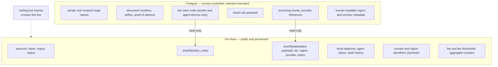

# Trust and compliance model

What this system asks you to trust, what it deliberately does not, and where the
data actually lives. Referenced from the compliance hook's and agent registry's
crate documentation.

The short version: **the ledger is a public, permanent, append-only record, so
nothing goes on it that a person would mind being public forever.** Everything
sensitive stays in Postgres, where retention limits and access control can
actually be enforced.

---

## The trust boundary

| On-chain | Off-chain |
| --- | --- |
| Transfer amount, token, expiry, status | Sender and recipient **names** |
| `sha256(claim_code)` | The claim code itself (two devices, nowhere else) |
| `sha256` of each attestation payload | Passport / ID **numbers** |
| Agent bond balance, status, region, slash history | Trade licences, verification documents, selfies |
| Region / corridor identifiers (`Symbol`s) | Travel-rule payloads |
| Fee and tier thresholds, aggregate volume counters | Human-readable names for regions and corridors |

### Why this is a constraint and not a policy

A ledger is append-only and world-readable. A home address written to one is a
permanent, irreversible disclosure with no deletion path. That is not a
compliance preference that can be relaxed under commercial pressure — it is a
property of the medium.

The consequence cascades: because the chain carries only `sha256` of the
attestation payload, **the payload becomes the system of record for the
underlying documents and must be protected to at least the standard of the
documents themselves.** "No PII on-chain" moves the obligation to the database.
It does not remove it. `docs/data-model.md` marks which tables carry PII for
exactly this reason.

### The attestation hash, and what it is not

`Attestation` carries five things beyond the hash: the subject, an ordinal tier,
a region, a provider tag and an expiry.

- **Tier** is ordinal so the contract can compare it against a threshold without
  knowing what "Standard" means. The mapping is `KycTier::rank()`, expressed as a
  method rather than a derived `Ord` so the on-chain `u32` tag and the business
  ordering cannot drift apart.
- **Expiry** forces periodic re-verification. A verification result is a snapshot
  of a person's circumstances at a point in time, not a permanent attribute.
- **Provider tag** makes a provider migration visible in the event history rather
  than silent. A corridor where every attestation switched issuer in one day is
  something an auditor should be able to see without asking.

**A hash is not a pseudonym.** It is a commitment, and it is only as
privacy-preserving as the payload's entropy. `sha256` of a structured JSON
document with a known schema is vulnerable to a dictionary attack by anyone who
can enumerate plausible field values — dates of birth, country codes, document
type prefixes. The hash therefore protects against *casual* disclosure of ledger
data. It is not a substitute for keeping the payload itself access-controlled.

---

## Who can do what

### The compliance hook

| Actor | Can | Cannot |
| --- | --- | --- |
| Admin (operator key) | Set tier thresholds, grant/revoke attester keys, register the escrow, pause all corridors | Read the underlying KYC record |
| Attester (backend key, hot) | Publish and revoke attestations for a subject | Change tiers, pause, read other subjects' records |
| Escrow contract | Commit a sender's volume after a successful check | Publish attestations |
| Anyone | Call `check_transfer_allowed` / `explain_transfer` (read-only, no writes) | Write anything |

`commit_transfer` accepts calls only from the registered escrow address and
refuses any other caller with `NotEscrow`. This closes the most obvious bypass:
a caller that passes the per-transfer gate but skips the commitment would bypass
the cumulative daily ceiling entirely.

The check and the commit are split so the escrow can do **reserve → commit inside
one atomic transaction**. The check decides, the commit records, and a failure in
either reverts the whole transfer. A single combined "check and commit" function
would either perform writes during a read-only simulation — which the sender app
needs to preflight amounts — or would leave a window for a second transfer to
consume the same headroom.

### The agent registry

| Actor | Can | Cannot |
| --- | --- | --- |
| Admin (operator key) | Create regions, set minimum bonds, map corridors, authorize / suspend / revoke agents, slash bonds | Move a pending transfer's funds |
| Agent | Post and top up its own bond, withdraw its own bond | Withdraw while authorized, withdraw more than it holds |
| Escrow contract | Read `is_authorized` | Write anything |

`is_authorized` is a pure read with no writes, so it is safe to call from a
read-only simulation and from the escrow's own pre-lock check.

### Escalation and de-escalation paths

- `authorize_agent` is the only path back to `Authorized`, and it accepts both
  `Pending` and `Suspended`. It re-checks the region's minimum bond, whether the
  region is active, and the region's agent cap — so re-authorising is not a
  rubber stamp. An agent suspended for a thin bond is refused until it tops up.
- `revoke_agent` is terminal. Attempting to revoke an already-revoked agent is
  rejected with `InvalidStatusTransition` rather than treated as a no-op, so a
  double-click cannot look like two revocations in the event log. A revoked agent
  can re-register with a fresh bond.
- `suspend_agent` is also applied **automatically** by a slash that drops the
  bond below the region minimum. Leaving an agent authorized-but-underbonded
  would mean its outstanding float is no longer covered.

---

## The bond: what it protects, and from whom

Cash-out fraud is the dominant last-mile risk. An agent takes a claim code, does
not hand over cash, and disappears — and because the escrowed funds are released
to the agent's settlement address at claim time, the network's only recourse is
the bond.

### What the bond is protecting against

| Risk | Whose bond | How the bond helps |
| --- | --- | --- |
| **Agent takes a claim code and withholds cash** | The agent's | Slashing converts a fraud gain into a capital loss on the same identity |
| **Agent draws float and disappears** | The agent's | The draw is capped by the bond at the pool's collateral ratio, so an agent's maximum exposure is bounded by capital it can lose |
| **Agent's float is recalled and depositors are stranded** | Liquidity providers' | The pool's utilization cap keeps an undrawn reserve, so a recall cannot make withdrawals fail |

### Why the two dials are the same dial

The registry sets the minimum bond per region. The pool reads that bond and
computes required collateral at `collateral_ratio_bps` (150%). Bond economics and
liquidity economics are therefore coupled: raising the collateral ratio makes
agents safer to the network *and* makes the region thinner.

That coupling is intentional and it is why `required_bond_for` exists as a pure
read. When a draw is refused, the agent needs to know the number to reach — an
agent app that shows a bare failure sends the agent to support instead of to its
wallet. Because the read is pure, it is callable on the failing path.

### Why slashing is admin-gated and cold

Slashing confiscates real capital from a small business. It is gated on the
operator key precisely because it is destructive, and the operator key is
documented as the highest-value secret in the system for that reason.

- Slashed funds go to the **treasury**, not to the operator's own account.
- Every slash **emits an event** with the amount and a reason `Symbol`.
- A slash is **capped at the bond**; it cannot reach into anything else.

Both the destination and the event exist so that slashing is auditable rather
than merely permitted. An operator that could slash into its own account would
have a direct financial interest in the outcome.

### Why a refund is permissionless

`refund_expired` can be called by **anyone** after expiry, and can only pay the
address recorded at creation. A refund that required operator action would be a
refund an operator could withhold, which would make the bond the only thing
standing between a sender and indefinitely locked funds. The permissionless
version means the sender's exit does not depend on anyone's cooperation — not the
operator's, not the agent's, and not their own key, if the sender has lost it.

---

## What the contracts deliberately do not do

| Not done | Where it lives instead | Why |
| --- | --- | --- |
| Verify identity | `backend/src/kyc-orchestration` | Changes on a provider timescale; must not require redeploying the escrow |
| Hold bonds | `AgentRegistry` | Separates anti-fraud collateral from custody |
| Price anything | `backend/src/quoting-service` | Rates change continuously; a contract that priced would need an oracle to trust |
| Store names or documents | Postgres | A permanent public record cannot be deleted when it should be |
| Enforce jurisdiction | The operator | Would be guessing at a legal regime, and a guess baked into an immutable ledger is worse than an obvious gap |
| Arbitrate disputes | Off-chain process | No on-chain mechanism can determine whether cash was handed over |

---

## Auditing

What a reviewer can verify from public data alone:

1. **Every state transition** — each contract emits a filtered event on every
   change, catalogued in `docs/events.md`. An agent's authorization history, a
   transfer's lifecycle and every threshold change are reconstructable from the
   event stream.
2. **Every privileged action** — configuration changes, wiring changes and key
   rotations emit events carrying the change.
3. **Every slash** — amount, reason and resulting bond balance.
4. **Every compliance refusal reason** in aggregate, via the typed error the
   backend observes and counts.

What a reviewer **cannot** verify from public data:

1. **That a given attestation corresponded to a real verification.** The chain
   holds a hash. Confirming the payload requires the database, and the database
   is the operator's. This is the deliberate limit of data minimisation.
2. **That cash was handed over.** Only that the on-chain claim settled. Agent SLA
   is a business control, not a cryptographic one.
3. **That a threshold change was justified.** Only that it happened and when.

Stating (1) plainly matters, because a system that implies more verifiability
than it delivers is worse than one that admits the limit: a regulator who assumes
the chain proves identity will not ask the operator for the evidence, and the
evidence is the part that matters.
